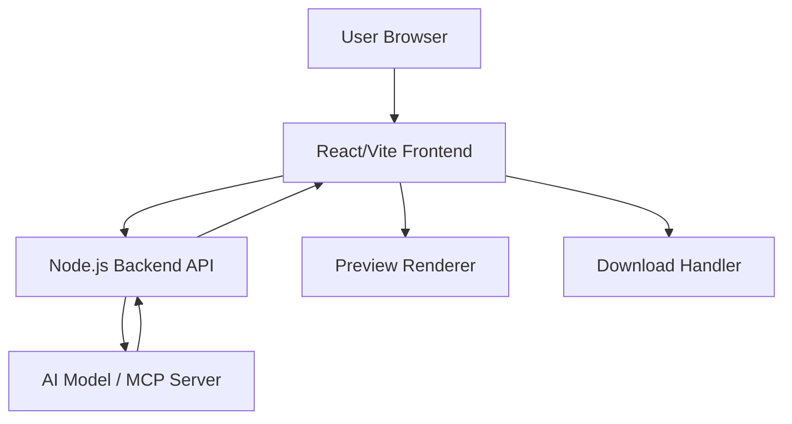

# GeoCities Reborn - Design Document

## Overview

GeoCities Reborn is a single-page web application that uses AI to generate authentic 90s-style webpages from user descriptions. The architecture follows a client-side-first approach with serverless AI generation, requiring no database or persistent storage. The system emphasizes speed, simplicity, and nostalgic authenticity.

## Architecture

### High-Level Architecture



### Component Overview

- **Frontend Application**: React/Vite SPA handling UI, state management, and user interactions
- **Backend API**: Node.js/Express server with endpoints for generation, remix, and publishing
- **Generation API**: API endpoints that interface with AI model for HTML generation
- **AI Generator**: LLM-based system (via MCP) that converts descriptions to retro HTML/CSS
- **Preview System**: Client-side iframe renderer for safe HTML preview
- **Publishing System**: Backend service for storing and serving published sites
- **Neighborhood Browser**: Frontend component for exploring published sites by theme
- **Storage Layer**: Simple file-based or key-value storage for published sites

### Technology Stack

- **Framework**: React 18+ with Vite
- **Styling**: Tailwind CSS for modern UI chrome, inline styles for generated content
- **AI Integration**: Node MCP server for HTML generation (via backend API)
- **State Management**: React hooks (useState, useReducer)
- **Build Tool**: Vite
- **Backend**: Node.js/Express for API endpoints
- **Deployment**: Frontend on Netlify/Vercel, Backend on Railway/Render

## Components and Interfaces

### 1. Input Component (`DescriptionInput`)

**Purpose**: Capture and validate user descriptions

**Props**:
```typescript
interface DescriptionInputProps {
  onSubmit: (description: string, theme?: ThemePreset) => void;
  isLoading: boolean;
  initialValue?: string;
}
```

**Responsibilities**:
- Text input with 10-500 character validation
- Optional theme preset selector (Cyber, Gamer, Glitter, Space)
- Submit button with loading state
- Display example prompts for guidance

### 2. Generator Service (`generatorService`)

**Purpose**: Interface with AI model to generate HTML

**Interface**:
```typescript
interface GeneratorService {
  generate(description: string, theme?: ThemePreset): Promise<GeneratedPage>;
  remix(originalDescription: string, previousHtml: string): Promise<GeneratedPage>;
}

interface GeneratedPage {
  html: string;
  description: string;
  theme?: ThemePreset;
  timestamp: number;
}

type ThemePreset = 'cyber' | 'gamer' | 'glitter' | 'space';
```

**Implementation Details**:
- Backend endpoint at `POST /api/generate` handles generation requests
- Frontend calls backend API using fetch or axios
- Backend constructs detailed prompts for AI model including:
  - User description
  - Theme-specific styling guidelines
  - Required retro elements (marquee, GIFs, tables, etc.)
  - 90s color palette constraints
- Validates generated HTML for basic structure
- Returns self-contained HTML with inline CSS

### 3. Preview Component (`PreviewPanel`)

**Purpose**: Safely render generated HTML

**Props**:
```typescript
interface PreviewPanelProps {
  html: string;
  onError?: (error: Error) => void;
}
```

**Responsibilities**:
- Render HTML in sandboxed iframe with `sandbox` attribute
- Handle iframe loading and error states
- Provide responsive scaling
- Support marquee and animated GIF rendering

**Security Considerations**:
- Use `sandbox="allow-scripts"` to enable marquee animations
- Prevent navigation and form submission
- Isolate from parent window context

### 4. Action Bar Component (`ActionBar`)

**Purpose**: Provide download, remix, and publish functionality

**Props**:
```typescript
interface ActionBarProps {
  html: string;
  description: string;
  theme?: ThemePreset;
  onRemix: () => void;
  onPublish: () => void;
  isRemixing: boolean;
  isPublishing: boolean;
  publishedUrl?: string;
}
```

**Responsibilities**:
- Download button triggering file save
- Remix button with loading state
- Publish button to save site to neighborhood
- Display published URL after successful publish
- Copy-to-clipboard functionality for published URL
- Generate descriptive filenames (e.g., `my-90s-gamer-page.html`)

### 5. AI Prompt Builder (`promptBuilder`)

**Purpose**: Construct effective prompts for HTML generation

**Interface**:
```typescript
interface PromptBuilder {
  buildGenerationPrompt(description: string, theme?: ThemePreset): string;
  buildRemixPrompt(description: string, previousHtml: string): string;
}
```

**Prompt Structure**:
```
Generate a complete, self-contained HTML page in authentic 90s GeoCities style.

User Description: {description}
Theme: {theme || 'inferred from description'}

Requirements:
- Single HTML file with inline CSS only
- Use table-based layout or frame-like divs
- Include 3-5 retro elements: marquee text, animated GIFs, pixel borders, neon text effects
- Apply 90s color schemes (neon, gradients, high contrast)
- Add background patterns or textures
- Use fonts like Comic Sans, Arial, Times New Roman
- Include visitor counter aesthetic
- Make it fun, chaotic, and nostalgic

Theme-Specific Guidelines:
{theme-specific color palettes and imagery}

Output only the complete HTML code, no explanations.
```

## Data Models

### GeneratedPage

```typescript
interface GeneratedPage {
  html: string;              // Complete HTML document
  description: string;       // Original user description
  theme?: ThemePreset;       // Selected theme if any
  timestamp: number;         // Generation time
}
```

### PublishedSite

```typescript
interface PublishedSite {
  id: string;                // Unique site identifier (e.g., "cyber-123abc")
  html: string;              // Complete HTML document
  description: string;       // Original user description
  theme: string;             // Theme neighborhood (cyber/gamer/glitter/space/random)
  publishedAt: number;       // Timestamp of publication
  url: string;               // Full public URL
}
```

### Neighborhood

```typescript
interface Neighborhood {
  name: string;              // Neighborhood name (Cyber, Gamer, etc.)
  theme: ThemePreset | 'random';
  siteCount: number;         // Number of published sites
  sites: PublishedSite[];    // List of sites in neighborhood
}
```

### ThemeConfig

```typescript
interface ThemeConfig {
  name: ThemePreset;
  colors: string[];          // Primary color palette
  keywords: string[];        // Theme-specific keywords for AI
  gifCategories: string[];   // Suggested GIF types
}

const THEME_CONFIGS: Record<ThemePreset, ThemeConfig> = {
  cyber: {
    name: 'cyber',
    colors: ['#00ff00', '#0000ff', '#ff00ff', '#000000'],
    keywords: ['matrix', 'digital', 'tech', 'hacker', 'cyber'],
    gifCategories: ['spinning-globe', 'under-construction', 'email-icon']
  },
  gamer: {
    name: 'gamer',
    colors: ['#ff0000', '#ffff00', '#00ff00', '#000080'],
    keywords: ['gaming', 'retro', 'arcade', 'pixel', 'console'],
    gifCategories: ['game-controller', 'pixel-art', 'fire']
  },
  glitter: {
    name: 'glitter',
    colors: ['#ff69b4', '#ffd700', '#ff1493', '#ffffff'],
    keywords: ['sparkle', 'glitter', 'cute', 'kawaii', 'stars'],
    gifCategories: ['sparkles', 'stars', 'hearts', 'rainbow']
  },
  space: {
    name: 'space',
    colors: ['#000033', '#ffffff', '#4169e1', '#9370db'],
    keywords: ['space', 'stars', 'galaxy', 'cosmic', 'alien'],
    gifCategories: ['stars', 'planets', 'ufo', 'astronaut']
  }
};
```

### Session State

```typescript
interface AppState {
  currentPage: GeneratedPage | null;
  isGenerating: boolean;
  isPublishing: boolean;
  publishedUrl: string | null;
  error: string | null;
  history: GeneratedPage[];  // Optional: keep last few generations
}
```

## Error Handling

### Input Validation Errors

- **Empty Description**: Display inline error "Please enter a description (10-500 characters)"
- **Too Short**: Display "Description too short. Try adding more details!"
- **Too Long**: Display character count and truncate at 500

### Generation Errors

- **API Timeout**: Retry once automatically, then show "Generation timed out. Please try again."
- **Invalid HTML**: Attempt to fix basic issues, fallback to error page with retry option
- **AI Service Unavailable**: Display "Service temporarily unavailable. Please try again in a moment."

### Preview Errors

- **Rendering Failure**: Show error message in preview panel with option to download raw HTML
- **Sandbox Restrictions**: Provide fallback preview with warning about limited functionality

### Error Recovery

```typescript
interface ErrorHandler {
  handleGenerationError(error: Error): void;
  handlePreviewError(error: Error): void;
  retry(): void;
}
```

All errors should:
- Display user-friendly messages
- Provide actionable next steps
- Log technical details to console for debugging
- Maintain application state (don't lose user input)

## Testing Strategy

### Unit Tests

- **Prompt Builder**: Verify correct prompt construction for each theme
- **Validation Logic**: Test input validation rules (length, content)
- **Download Handler**: Verify filename generation and blob creation

### Integration Tests

- **Generation Flow**: Test end-to-end from input to preview
- **Remix Functionality**: Verify remix produces different output
- **Theme Application**: Confirm themes influence generation correctly

### Manual Testing

- **Visual Authenticity**: Human review of generated pages for 90s aesthetic
- **Browser Compatibility**: Test preview rendering in Chrome, Firefox, Safari
- **Download Verification**: Confirm downloaded files open correctly
- **Responsive Behavior**: Test on different viewport sizes

### Performance Targets

- **Generation Time**: < 10 seconds for 95% of requests
- **Preview Render**: < 2 seconds after HTML received
- **Download Trigger**: < 500ms from click to file save
- **Page Load**: < 3 seconds for initial app load

## Implementation Notes

### AI Model Integration

The system uses an MCP (Model Context Protocol) server for HTML generation. The MCP server should:
- Accept structured prompts with description and theme
- Return raw HTML strings
- Handle rate limiting gracefully
- Support streaming responses for faster perceived performance

### Retro Element Library

Consider maintaining a curated list of:
- 90s-appropriate color hex codes
- Common GIF URLs or data URIs for inline embedding
- Classic background patterns (starfield, gradient, texture)
- Authentic 90s font stacks

### Future Enhancements (Post-MVP)

- Gallery of generated pages (requires storage)
- Social sharing functionality
- Custom GIF upload
- More theme presets
- Edit mode for manual tweaking
- Export to ZIP with separate CSS file option


### 6. Neighborhood Browser Component (`NeighborhoodBrowser`)

**Purpose**: Allow users to explore published sites by theme

**Props**:
```typescript
interface NeighborhoodBrowserProps {
  onNavigate: (siteId: string) => void;
}
```

**Responsibilities**:
- Display list of neighborhoods (Cyber, Gamer, Glitter, Space, Random)
- Show site count for each neighborhood
- Fetch and display sites when neighborhood is selected
- Provide thumbnail or title preview for each site
- Handle navigation to individual published sites

### 7. Publishing Service (`publishingService`)

**Purpose**: Handle site publication and retrieval

**Interface**:
```typescript
interface PublishingService {
  publish(html: string, description: string, theme?: ThemePreset): Promise<PublishedSite>;
  getSite(id: string): Promise<PublishedSite>;
  getNeighborhood(theme: string): Promise<Neighborhood>;
  getAllNeighborhoods(): Promise<Neighborhood[]>;
}
```

**Implementation Details**:
- API endpoint at `/api/publish` handles site publication
- Generate unique site ID using nanoid or similar (e.g., "cyber-x7k2p9")
- Store HTML and metadata in file system or simple key-value store
- Organize storage by theme/neighborhood
- API endpoint at `/api/sites/:id` serves individual published sites
- API endpoint at `/api/neighborhoods` lists all neighborhoods
- API endpoint at `/api/neighborhoods/:theme` lists sites in a neighborhood

## Storage Strategy

### File-Based Storage (Simple MVP Approach)

```
/published-sites/
  /cyber/
    cyber-x7k2p9.json
    cyber-a3b8c1.json
  /gamer/
    gamer-m4n5o6.json
  /glitter/
  /space/
  /random/
  index.json  // Metadata index for quick lookups
```

Each JSON file contains:
```json
{
  "id": "cyber-x7k2p9",
  "html": "<!DOCTYPE html>...",
  "description": "my awesome cyber page",
  "theme": "cyber",
  "publishedAt": 1700000000000,
  "url": "https://geocities-reborn.com/sites/cyber-x7k2p9"
}
```

### Alternative: Key-Value Store (Redis/Upstash)

For better scalability, use Redis with keys like:
- `site:cyber-x7k2p9` → PublishedSite JSON
- `neighborhood:cyber` → List of site IDs
- `neighborhood:cyber:count` → Site count

## Routing Strategy

### Frontend Routes

- `/` - Main generator interface
- `/neighborhoods` - Neighborhood browser
- `/sites/:id` - View individual published site

### Backend API Routes

- `POST /api/generate` - Generate new site
- `POST /api/remix` - Remix existing site
- `POST /api/publish` - Publish site to neighborhood
- `GET /api/sites/:id` - Get published site
- `GET /api/neighborhoods` - List all neighborhoods
- `GET /api/neighborhoods/:theme` - Get sites in neighborhood
